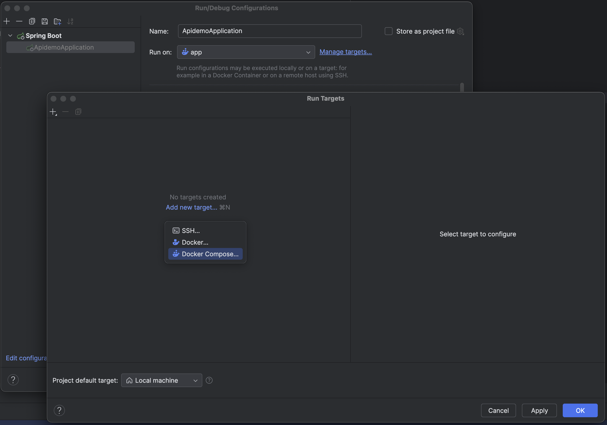

# API

## Build Production Image

```shell
docker build . --target=production --tag=apidemo:latest --no-cache
```

## Run Production Image

```shell
docker run -p 9090:9090 apidemo:latest
```

## Run Development in IntelliJ

Configure Targets in Run Configuration:


